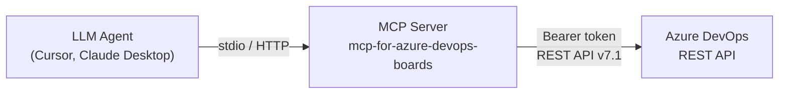
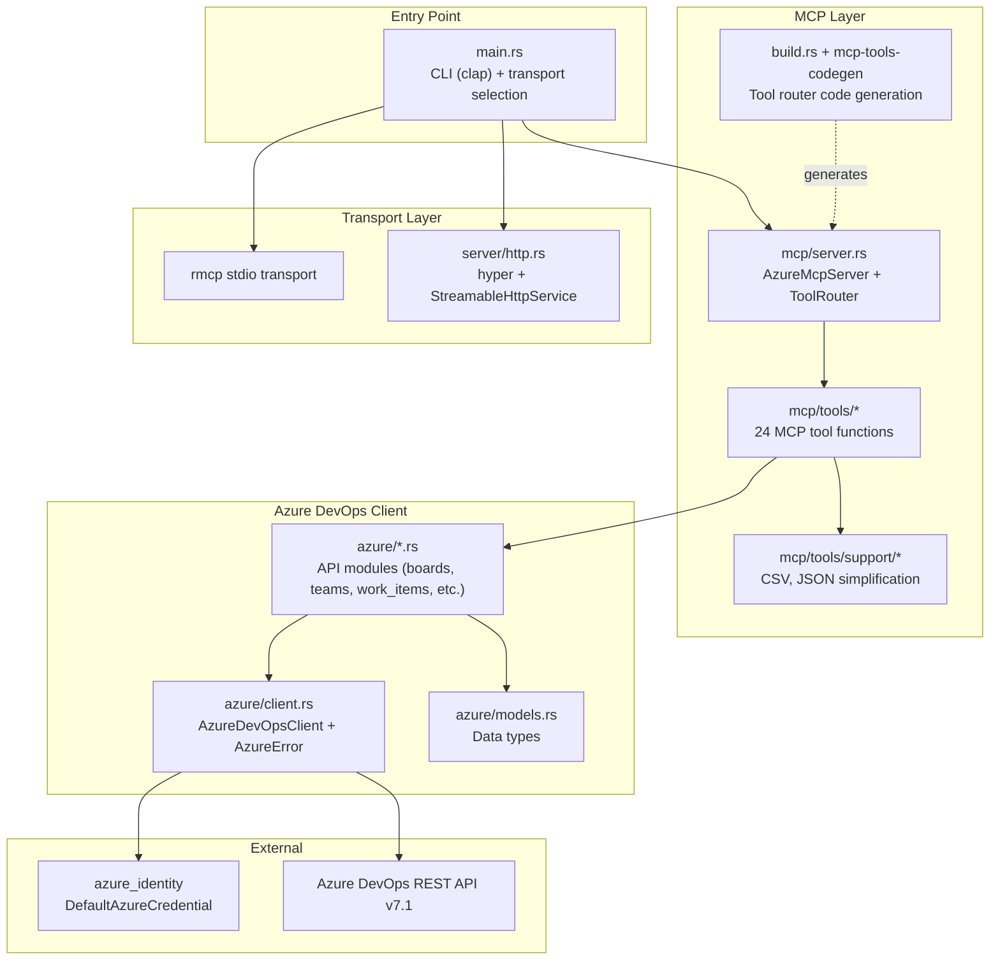
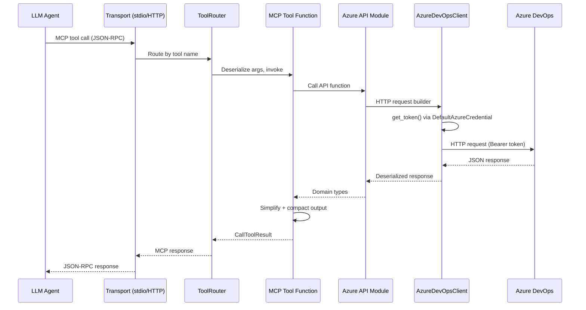
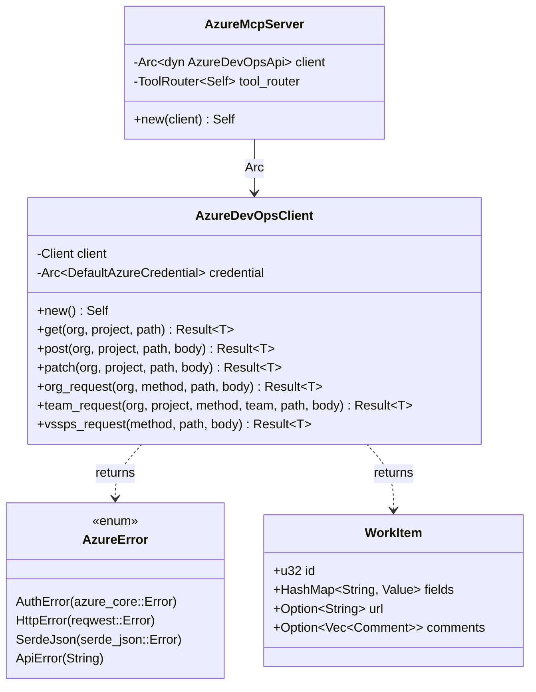
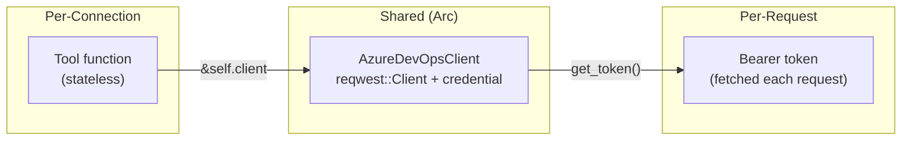

# Architecture

## System Overview



## Project Structure

```
├── Cargo.toml                    # Workspace root + main crate
├── Cargo.lock
├── build.rs                      # Scans #[mcp_tool] → generates tool router
├── Makefile                      # build, test, lint, fmt targets
├── Dockerfile                    # Multi-stage: rust:alpine → alpine
├── tests/                        # Integration tests (anti-prompt-injection, tool behavior)
│   ├── common/
│   │   └── mod.rs                # Shared helpers (assert_tool_output_has_warning)
│   ├── test_tools_organizations.rs
│   ├── test_tools_projects.rs
│   ├── test_tools_teams.rs
│   ├── test_tools_boards.rs
│   ├── test_tools_tags.rs
│   ├── test_tools_work_item_types.rs
│   ├── test_tools_classification_nodes.rs
│   └── test_tools_work_items.rs
├── src/
│   ├── main.rs                   # CLI entry (clap), transport selection
│   ├── lib.rs                    # Library root: re-exports modules
│   ├── compact_llm.rs            # Compact JSON serializer for LLM output
│   ├── azure/                    # Azure DevOps API client layer
│   │   ├── mod.rs
│   │   ├── client.rs             # AzureDevOpsClient, AzureError, auth, HTTP helpers
│   │   ├── api_trait.rs          # AzureDevOpsApi trait + MockAzureDevOpsApi (test-support feature)
│   │   ├── models.rs             # Shared data types (WorkItem, Board, Comment, etc.)
│   │   ├── boards.rs             # Boards API
│   │   ├── classification_nodes.rs # Area/Iteration paths API
│   │   ├── iterations.rs         # Iterations API
│   │   ├── organizations.rs      # Organizations API
│   │   ├── projects.rs           # Projects API
│   │   ├── tags.rs               # Tags API
│   │   ├── teams.rs              # Teams API
│   │   └── work_items.rs         # Work items API (CRUD, WIQL, comments, links)
│   ├── mcp/                      # MCP server layer
│   │   ├── mod.rs
│   │   ├── server.rs             # AzureMcpServer, ServerHandler, includes generated_tools.rs
│   │   └── tools/                # MCP tool implementations
│   │       ├── mod.rs
│   │       ├── classification_nodes/   # list_area_paths, list_iteration_paths
│   │       ├── organizations/          # list_organizations, get_current_user
│   │       ├── projects/               # list_projects
│   │       ├── tags/                   # list_tags
│   │       ├── teams/                  # list_teams, get_team, list_team_members, get_team_current_iteration
│   │       │   └── boards/             # list_team_boards, get_team_board, list_board_columns, list_board_rows
│   │       ├── work_item_types/        # list_work_item_types
│   │       ├── work_items/             # create, update, get, get_many, query, wiql_query, link, add_comment
│   │       └── support/                # Shared utilities (CSV, JSON simplification, deserializers)
│   └── server/                   # HTTP transport
│       ├── mod.rs
│       └── http.rs               # hyper + rmcp StreamableHttpService
├── mcp-tools-codegen/            # Proc-macro crate
│   ├── Cargo.toml
│   └── src/
│       └── lib.rs                # #[mcp_tool] attribute macro
├── .github/workflows/            # CI/CD
│   ├── ci-pr-build-and-test.yml
│   └── cd-tag-build-and-release.yml
└── docs/
    ├── PROJECT.md
    └── ARCHITECTURE.md
```

## Layer Architecture



## Request Flow



## MCP Tools

| Category | Tool | Description |
|---|---|---|
| **Organizations** | `azdo_list_organizations` | List accessible organizations |
| | `azdo_get_current_user` | Get current authenticated user |
| **Projects** | `azdo_list_projects` | List projects in an organization |
| **Tags** | `azdo_list_tags` | List tags in a project |
| **Work Item Types** | `azdo_list_work_item_types` | List work item types in a project |
| **Classification** | `azdo_list_iteration_paths` | List iteration paths |
| | `azdo_list_area_paths` | List area paths |
| **Teams** | `azdo_list_teams` | List teams in a project |
| | `azdo_get_team` | Get team details |
| | `azdo_list_team_members` | List team members |
| | `azdo_get_team_current_iteration` | Get current iteration for a team |
| **Boards** | `azdo_list_team_boards` | List boards for a team |
| | `azdo_get_team_board` | Get board details |
| | `azdo_list_board_columns` | List board columns |
| | `azdo_list_board_rows` | List board rows/swimlanes |
| **Work Items** | `azdo_create_work_item` | Create a work item |
| | `azdo_update_work_item` | Update a work item |
| | `azdo_get_work_item` | Get work item by ID |
| | `azdo_get_work_items` | Get multiple work items by IDs |
| | `azdo_query_work_items` | Query work items (natural language → WIQL) |
| | `azdo_query_work_items_by_wiql` | Query work items by raw WIQL |
| | `azdo_link_work_items` | Link two work items |
| | `azdo_add_comment` | Add comment to a work item |
| | `azdo_update_comment` | Update a comment on a work item |

## Key Data Types



## Shared State Model



- `AzureMcpServer` is `Clone` (wraps `Arc<AzureDevOpsClient>`)
- Each HTTP connection gets a clone of `AzureMcpServer`
- `AzureDevOpsClient` contains `reqwest::Client` (internally Arc'd, connection-pooled) and `Arc<DefaultAzureCredential>`
- Bearer tokens are fetched per-request (credential SDK handles caching)
